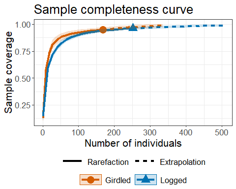
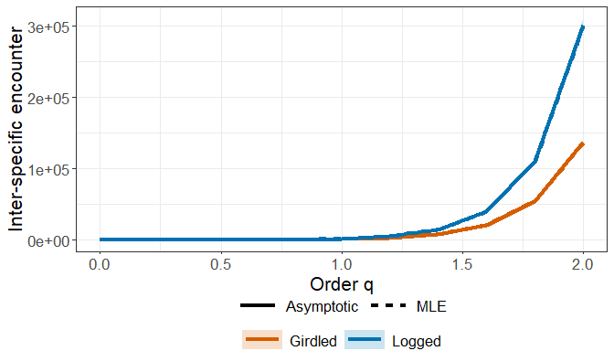

<!-- README.md is generated from README.Rmd. Please edit that file -->

# iNEXT.IE (R package)

<h5 align="right">
Latest version: 2025-09-24
</h5>
<font color="394CAE">
<h3 color="394CAE" style="font-weight: bold">
Introduction to iNEXT.IE (R package): Excerpt from iNEXT.IE User’s Guide
</h3>
</font> <br>
<h5>
<b>Kai-Hsiang Hu and Anne Chao</b> <br><br> <i>Institute of Statistics,
National Tsing Hua University, Hsin-Chu, Taiwan 30043</i>
</h5>

<br> `iNEXT.IE` (INterpolation and EXTrapolation for Inter-specific
Encounter) is a framework for biodiversity methodology. An online
version “iNEXT.IE Online”
(<https://kaihsiang-hu.shinyapps.io/iNEXT_IE/>) is also available for
users without an R background.

`iNEXT.IE` features two statistical analyses (non-asymptotic and
asymptotic):

1.A non-asymptotic approach based on interpolation and extrapolation for
diversity

`iNEXT.IE` computes the estimated diversity for standardized samples
with a common sample size or sample completeness. This approach aims to
compare diversity estimates for equally-large (with a common sample
size) or equally-complete (with a common sample coverage) samples; it is
based on the seamless rarefaction and extrapolation (R/E) sampling
curves of diversity for q = 0, 1 and 2. `iNEXT.IE` offers three types of
R/E sampling curves:

-   Sample-size-based (or size-based) R/E sampling curves: This type of
    sampling curve plots the diversity estimates with respect to sample
    size.

-   Coverage-based R/E sampling curves: This type of sampling curve
    plots the diversity estimates with respect to sample coverage.

-   Sample completeness curve: This curve depicts how sample coverage
    varies with sample size. The sample completeness curve provides a
    bridge between the size- and coverage-based R/E sampling curves.

2.An asymptotic approach to infer asymptotic diversity

`iNEXT.IE` computes the estimated asymptotic diversity and also plots
diversity profiles (q-profiles) for q between 0 and 2, in comparison
with the maximum likelihood estimation. Typically, the asymptotic
estimates for q ≥ 1 are reliable, but for q \< 1 (especially for q = 0,
species richness), the asymptotic estimates represent only lower bounds.

## How to cite

If you publish your work based on results from `iNEXT.IE` package, you
should make references to the following methodology paper and the
package:

-   Hu, K.-H. and Chao, A. (2025). The iNEXT.IE package: INterpolation
    and EXTrapolation for Inter-specific Encounter. R package available
    from CRAN.

## SOFTWARE NEEDED TO RUN iNEXT.IE IN R

-   Required: [R](https://cran.r-project.org/)
-   Suggested: [RStudio
    IDE](https://www.rstudio.com/products/RStudio/#Desktop)

## HOW TO RUN iNEXT.IE:

The `iNEXT.IE` package can be downloaded from CRAN or Kai-Hsiang Hu’s
[iNEXT.IE_github](https://github.com/KaiHsiangHu/iNEXT.IE) using the
commands below. For a first-time installation, some additional packages
must be installed and loaded; see package manual.

``` r
## install iNEXT.IE package from CRAN
install.packages("iNEXT.IE")  

## or install the latest version from github
install.packages('devtools')
library(devtools)
install_github('KaiHsiangHu/iNEXT.IE')

## import packages
library(iNEXT.IE)
```

There are six main functions in this package:

Two functions for non-asymptotic analysis with graphical displays:

-   **iNEXTIE** computes standardized diversity estimates of order q =
    0, 1 and 2 for rarefied and extrapolated samples at specified sample
    coverage values and sample sizes.

-   **ggiNEXTIE** visualizes the output from the function `iNEXTIE`.

Two functions for point estimation and basic data information

-   **estimateIE** computes diversity of order q = 0, 1 and 2 with a
    particular set of user-specified level of sample sizes or sample
    coverage values.

-   **DataInfoIE** provides basic data information based on the observed
    data.

Two functions for asymptotic analysis with graphical displays:

-   **MLEAsyIE** computes maximum likelihood estimation and asymptotic
    diversity estimates of order q between 0 and 2 (in increments of
    0.2) for diversity.

-   **ggMLEAsyIE** visualizes the output from the function `MLEAsyIE`.

## <span style="color:red;">DATA INPUT FORMAT</span>

### Species abundance data format

For `iNEXT.IE` package, information on species identity (or any unique
identification code) and assemblage affiliation is not required.

Individual-based abundance data: Data can be input as a vector of
species abundances (for a single assemblage), a species (in rows) by
assemblage (in columns) matrix/data.frame, or a list of species
abundance vectors.

For example, we generate an example for illustration.

``` r
set.seed(2025)
data = list("Site_1" = as.numeric(rmultinom(1, 200, 1:30)), 
            "Site_2" = as.numeric(rmultinom(1, 300, 1:40)))
data
$Site_1
 [1]  1  1  1  2  3  2  5  1  4  4  4  9  6  2  6 10  6  7 10  5  8 12  5 13 10 16 13  9 15 10

$Site_2
 [1]  0  0  0  1  2  3  1  1  2  9  7  4  8  7  7 13  8  8  4  6  7  4 10  6  6  9  8  9 11 13 12  8 14 18  9  8 16 15 12 14
```

## <span style="color:red;">MAIN FUNCTION iNEXTIE(): RAREFACTION/EXTRAPOLATION</span>

We first describe the main function `iNEXTIE()` with default arguments:

``` r
iNEXTIE(data, rho, q = c(0, 1, 2), size = NULL, endpoint = NULL, knots = 40, nboot = 50, conf = 0.95)
```

The arguments of this function are briefly described below, and will be
explained in more details by illustrative examples in later text. This
main function computes standardized diversity estimates of order q = 0,
1 and 2, the sample coverage estimates, and related statistics for K (if
`knots = K` in the specified argument) evenly-spaced knots (sample
sizes) between size 1 and the `endpoint`, where the endpoint is
described below. Each knot represents a particular sample size for which
diversity estimates will be calculated. By default, `endpoint` = double
the reference sample size or total individuals. For example, if
`endpoint = 10`, `knot = 4` is specified, diversity estimates will be
computed for a sequence of samples with sizes (1, 4, 7, 10).

<table class="gmisc_table" style="border-collapse: collapse; margin-top: 1em; margin-bottom: 1em;">
<thead>
<tr>
<th style="font-weight: 900; border-bottom: 1px solid grey; border-top: 2px solid grey; text-align: center;">
Argument
</th>
<th style="font-weight: 900; border-bottom: 1px solid grey; border-top: 2px solid grey; text-align: center;">
Description
</th>
</tr>
</thead>
<tbody>
<tr>
<td style="text-align: left;">
data
</td>
<td style="text-align: left;">
data can be input as a vector of species abundances (for a single
assemblage), matrix/data.frame (species by assemblages), or a list of
species abundance vectors.
</td>
</tr>
<tr>
<td style="text-align: left;">
rho
</td>
<td style="text-align: left;">
the sampling fraction can be input as a vector for each assemblage or a
numeric common value for all assemblages.
</td>
</tr>
<tr>
<td style="text-align: left;">
q
</td>
<td style="text-align: left;">
a numerical vector specifying the diversity orders. Default is
<code>c(0, 1, 2)</code>.
</td>
</tr>
<tr>
<td style="text-align: left;">
datatype
</td>
<td style="text-align: left;">
data type of input data: individual-based abundance data (<code>datatype
= ‘abundance’</code>), or species by sampling-units incidence/occurrence
matrix (<code>datatype = ‘incidence_raw’</code>) with all entries being
0 (non-detection) or 1 (detection).
</td>
</tr>
<tr>
<td style="text-align: left;">
size
</td>
<td style="text-align: left;">
an integer vector of sample sizes (number of individuals) for which
diversity estimates will be computed. If <code>NULL</code>, then
diversity estimates will be computed for those sample sizes determined
by the specified/default <code>endpoint</code> and <code>knots</code>.
</td>
</tr>
<tr>
<td style="text-align: left;">
endpoint
</td>
<td style="text-align: left;">
an integer specifying the sample size that is the <code>endpoint</code>
for rarefaction/extrapolation. If NULL, then <code>endpoint</code>
<code>=</code> double the reference sample size or total individuals.
</td>
</tr>
<tr>
<td style="text-align: left;">
knots
</td>
<td style="text-align: left;">
an integer specifying the number of equally-spaced <code>knots</code>
(say K, default is 40) between size 1 and the <code>endpoint</code>;
each knot represents a particular sample size for which diversity
estimate will be calculated. If the <code>endpoint</code> is smaller
than the reference sample size, then <code>iNEXTIE()</code> computes
only the rarefaction estimates for approximately K evenly spaced
<code>knots</code>. If the <code>endpoint</code> is larger than the
reference sample size, then <code>iNEXTIE()</code> computes rarefaction
estimates for approximately K/2 evenly spaced <code>knots</code> between
sample size 1 and the reference sample size, and computes extrapolation
estimates for approximately K/2 evenly spaced <code>knots</code> between
the reference sample size and the <code>endpoint</code>.
</td>
</tr>
<tr>
<td style="text-align: left;">
nboot
</td>
<td style="text-align: left;">
a positive integer specifying the number of bootstrap replications when
assessing sampling uncertainty and constructing confidence intervals.
Enter 0 to skip the bootstrap procedures. Default is 50.
</td>
</tr>
<tr>
<td style="border-bottom: 2px solid grey; text-align: left;">
conf
</td>
<td style="border-bottom: 2px solid grey; text-align: left;">
a positive number \< 1 specifying the level of confidence interval.
Default is 0.95.
</td>
</tr>
</tbody>
</table>

The main function `iNEXTIE()` returns the `iNEXTIE` object, which can be
further used to make plots using the function `ggiNEXTIE()` to be
described below. The `"iNEXTIE"` object includes three lists:

1.  `$DataInfo` for summarizing data information.

2.  `$iNextEst` for showing diversity estimates along with related
    statistics for a series of rarefied and extrapolated samples; there
    are two data frames (`$size_based` and `$coverage_based`)
    conditioning on standardized sample size or sample coverage,
    respectively.

3.  `$AsyEst` for showing maximum likelihood estimation and asymptotic
    diversity estimates along with related statistics.

## <span style="color:red;">FUNCTION ggiNEXTIE(): GRAPHIC DISPLAYS</span>

The function `ggiNEXTIE()`, which extends `ggplot2` with default
arguments, is described as follows:

``` r
ggiNEXTIE(output, type = 1:3)  
```

Here `output` is the `iNEXTIE()` object. Three types of curves are
allowed for diversity:

1.  Sample-size-based R/E curve (`type = 1`): This curve plots diversity
    estimates with confidence intervals as a function of sample size.

2.  Sample completeness curve (`type = 2`): This curve plots the sample
    coverage with respect to sample size.

3.  Coverage-based R/E curve (`type = 3`): This curve plots the
    diversity estimates with confidence intervals as a function of
    sample coverage.

The `ggiNEXTIE()` function is a wrapper with the package `ggplot2` to
create a rarefaction/extrapolation sampling curve in a single line of
code. The figure object is of class `"ggplot"`, so it can be manipulated
by using the `ggplot2` tools.

## <span style="color:blue;">RAREFACTION/EXTRAPOLATION VIA EXAMPLES</span>

### EXAMPLE: rarefaction/extrapolation for abundance data

Based on the dataset, the following commands return all numerical
results. The first list of the output (`$DataInfo`) returns basic data
information including the name of the Assemblage, sample size (`n`),
total abundance (`N`), sampling fraction (`rho`), observed species
richness (`S.obs`), sample coverage estimate of the reference sample
with size n (`SC(n)`), sample coverage estimate of the extrapolated
sample with size 2n (`SC(2n)`) as well as the first five species
abundance frequency counts in the reference sample (`f1-f5`). If only
data information is required, the simpler function `DataInfoIE()` (see
later text) can be used to obtain the same output. More information
about the maximum likelihood estimation (for any order q between 0 and
2) can be obtained by function `MLEAsyIE()`, which will be introduced
later.

``` r
set.seed(2025)
data = list("Site_1" = as.numeric(rmultinom(1, 200, 1:30)), 
            "Site_2" = as.numeric(rmultinom(1, 300, 1:40)))

output_iNEXT <- iNEXTIE(data, rho = 0.3, q = c(0, 1, 2))
output_iNEXT$DataInfo
```

    $DataInfo
      Assemblage   n    N rho S.obs SC(n) SC(2n) f1 f2 f3 f4 f5
    1     Site_1 200  667 0.3    30 0.986  0.999  4  3  1  3  3
    2     Site_2 300 1000 0.3    37 0.993  0.999  3  2  1  3  0

The second list of the output (`$iNextEst`) includes size- and
coverage-based standardized diversity estimates and related statistics
computed for 40 knots by default. There are two data frames
(`$size_based` and `$coverage_based`).

The first data frame (`$size_based`) includes the name of the assemblage
(`Assemblage`), diversity order (`Order.q`), the target sample size
(`m`), the `Method` (`Rarefaction`, `Observed`, or `Extrapolation`,
depending on whether the size `m` is less than, equal to, or greater
than the reference sample size), the diversity estimate of order q
(`qIE`), the lower and upper confidence limits of diversity (`qIE.LCL`
and `qIE.UCL`) conditioning on the sample size, and the corresponding
sample coverage estimate (`SC`) along with the lower and upper
confidence limits of sample coverage (`SC.LCL` and `SC.UCL`). These
sample coverage estimates with confidence intervals are used for
plotting the sample completeness curve. If the argument `nboot` is
greater than zero, then a bootstrap method is applied to obtain the
confidence intervals for the diversity and sample coverage estimates.
Otherwise, all confidence intervals will not be computed. Here only the
first six rows of the `$size_based` output are displayed:

``` r
output_iNEXT$iNextEst$size_based
```

      Assemblage Order.q  m      Method    qIE qIE.LCL qIE.UCL    SC SC.LCL SC.UCL
    1     Site_1       0  1 Rarefaction  0.000   0.000   0.000 0.044  0.039  0.049
    2     Site_1       0 11 Rarefaction  7.961   7.775   8.147 0.382  0.355  0.410
    3     Site_1       0 21 Rarefaction 13.241  12.764  13.718 0.590  0.562  0.618
    4     Site_1       0 32 Rarefaction 17.139  16.375  17.903 0.729  0.705  0.754
    5     Site_1       0 42 Rarefaction 19.596  18.619  20.573 0.808  0.787  0.830
    6     Site_1       0 53 Rarefaction 21.544  20.375  22.713 0.863  0.844  0.883

The second data frame (`$coverage_based`) includes the name of
assemblage (`Assemblage`), the diversity order (`Order.q`), the target
sample coverage value (`SC`), the corresponding sample size (`m`), the
`Method` (`Rarefaction`, `Observed`, or `Extrapolation`, depending on
whether the coverage `SC` is less than, equal to, or greater than the
reference sample coverage), the diversity estimate of order q (`qIE`),
the lower and upper confidence limits of diversity (`qIE.LCL` and
`qIE.UCL`) conditioning on the target sample coverage value. Here only
the first six rows of the `$coverage_based` output are displayed below:
(Note for a fixed coverage value, the confidence interval in the
`$coverage_based` table is wider than the corresponding interval in the
`$size_based` table. This is because, for a given coverage value, the
sample size needed to attain a fixed coverage value varies with
bootstrap replication, leading to higher uncertainty on the resulting
diversity estimate.)

``` r
output_iNEXT$iNextEst$coverage_based
```

      Assemblage Order.q    SC  m      Method    qIE qIE.LCL qIE.UCL
    1     Site_1       0 0.044  1 Rarefaction  0.000   0.000   0.101
    2     Site_1       0 0.382 11 Rarefaction  7.961   7.163   8.760
    3     Site_1       0 0.590 21 Rarefaction 13.241  12.070  14.411
    4     Site_1       0 0.729 32 Rarefaction 17.139  15.714  18.564
    5     Site_1       0 0.808 42 Rarefaction 19.596  17.988  21.203
    6     Site_1       0 0.863 53 Rarefaction 21.544  19.753  23.334

The third list of the output (`$AsyEst`) includes the name of the
Assemblage, diversity order (q = 0, 1, 2), the maximum likelihood
estimation estimate (`IE_MLE`), asymptotic diversity estimate (`IE_asy`)
and its estimated bootstrap standard error (`s.e.`) as well as the
confidence intervals for asymptotic diversity (`qIE.LCL` and `qIE.UCL`).
These statistics are computed only for q = 0, 1 and 2. More detailed
information about maximum likelihood estimation and asymptotic diversity
estimates for any order q between 0 and 2 can be obtained from function
`MLEAsyIE()`. The output for `$AsyEst` is shown below:

``` r
output_iNEXT$AsyEst
```

      Assemblage Order.q     IE_MLE     IE_asy    s.e.    qIE.LCL    qIE.UCL
    1     Site_1       0     29.000     31.066   2.700     25.775     36.357
    2     Site_1       1   2133.989   2175.579  33.213   2110.483   2240.676
    3     Site_1       2 211700.000 212433.256 600.370 211256.552 213609.960
    4     Site_2       0     36.000     37.698   2.013     33.752     41.644
    5     Site_2       1   3472.033   3519.637  18.734   3482.919   3556.356
    6     Site_2       2 482644.444 483434.947 513.132 482429.227 484440.667

The `ggiNEXTIE` function can be used to make graphical displays for
rarefaction and extrapolation sampling curves. An example for showing
sample-size-based rarefaction/extrapolation curves (`type = 1`) is given
below:

``` r
# Sample-size-based R/E curves
ggiNEXTIE(output_iNEXT, type = 1)
```


The following commands return the sample completeness (sample coverage)
curve (`type = 2`) in which different colors represent different
assemblages.

``` r
# Sample completeness curves for abundance data
ggiNEXTIE(output_iNEXT, type = 2)
```



The following commands return the coverage-based
rarefaction/extrapolation sampling curves in which different color
curves represent two assemblages within each diversity order.

``` r
# Coverage-based R/E curves
ggiNEXTIE(output_iNEXT, type = 3)
```


## <span style="color:red;">FUNCTION DataInfoIE(): DATA INFORMATION</span>

The function `DataInfoIE()` provides basic data information for the
reference sample in each assemblage. The function `DataInfoIE()` with
default arguments is shown below:

``` r
DataInfoIE(data, rho) 
```

All arguments in the above function are the same as those for the main
function `iNEXTIE`. Running the `DataInfoIE()` function returns basic
data information including sample size, total abundance, sampling
fraction, observed species richness, sample coverage estimates of the
reference sample (`SC(n)`), sample coverage estimate for twice the
reference sample size (`SC(2n)`). We use data to demo the function.

### Basic data information for abundance data

``` r
set.seed(2025)
data = list("Site_1" = as.numeric(rmultinom(1, 200, 1:30)), 
            "Site_2" = as.numeric(rmultinom(1, 300, 1:40)))
DataInfoIE(data, rho = 0.3)
```

      Assemblage   n    N rho S.obs SC(n) SC(2n) f1 f2 f3 f4 f5
    1     Site_1 200  667 0.3    30 0.986  0.999  4  3  1  3  3
    2     Site_2 300 1000 0.3    37 0.993  0.999  3  2  1  3  0

Output description:

-   `Assemblage` = assemblage name.

-   `n` = number of observed individuals in the reference sample (sample
    size).

-   `N` = total abundance in the overall assemblage.

-   `rho` = sampling fraction of the reference sample.

-   `S.obs` = number of observed species in the reference sample.

-   `SC(n)` = sample coverage estimate of the reference sample with size
    n.

-   `SC(2n)` = sample coverage estimate of the reference sample with
    size 2n.

-   `f1`-`f5` = the first five species abundance frequency counts in the
    reference sample.

## <span style="color:red;">FUNCTION estimateIE(): POINT ESTIMATION</span>

`estimateIE` is used to compute diversity estimates with q = 0, 1, 2
under any specified levels of sample size (when `base = "size"`) and
sample coverage values (when `base = "coverage"`) for abundance data.
When `base = "size"`, `level` can be specified with a particular vector
of sample sizes (greater than 0); if `level = NULL`, this function
computes the diversity estimates for the minimum sample size among all
samples extrapolated to the double reference sizes or total individuals.
When `base = "coverage"`, `level` can be specified with a particular
vector of sample coverage values (between 0 and 1); if `level = NULL`,
this function computes the diversity estimates for the minimum sample
coverage among all samples extrapolated to the double reference sizes or
total individuals. All arguments in the function are the same as those
for the main function `iNEXTIE`.

``` r
estimateIE(data, rho, q = c(0, 1, 2), base = "coverage", level = NULL, nboot = 50, conf = 0.95) 
```

### Example: abundance data with two target coverage values (97% and 99%)

The following commands return the estimates with two specified levels of
sample coverage (97% and 99%).

``` r
set.seed(2025)
data = list("Site_1" = as.numeric(rmultinom(1, 200, 1:30)), 
            "Site_2" = as.numeric(rmultinom(1, 300, 1:40)))

output_est_cov <- estimateIE(data, rho = 0.3, q = c(0, 1, 2), base = "coverage", level = c(0.97, 0.99))
output_est_cov
```

       Assemblage Order.q   SC       m        Method       qIE      s.e.  qIE.LCL   qIE.UCL
    1      Site_1       0 0.97 127.729   Rarefaction    27.048     1.655   23.804    30.292
    2      Site_1       0 0.99 233.636 Extrapolation    29.592     2.788   24.127    35.057
    3      Site_1       1 0.97 127.729   Rarefaction   414.169    66.938  282.972   545.366
    4      Site_1       1 0.99 233.636 Extrapolation   760.934   209.753  349.825  1172.042
    5      Site_1       2 0.97 127.729   Rarefaction  7749.155  2936.694 1993.341 13504.969
    6      Site_1       2 0.99 233.636 Extrapolation 25919.652 18251.484    0.000 61691.903
    7      Site_2       0 0.97 136.860   Rarefaction    33.172     0.994   31.224    35.119
    8      Site_2       0 0.99 241.897   Rarefaction    35.334     1.518   32.359    38.309
    9      Site_2       1 0.97 136.860   Rarefaction   479.177    32.276  415.918   542.436
    10     Site_2       1 0.99 241.897   Rarefaction   849.916   172.482  511.857  1187.976
    11     Site_2       2 0.97 136.860   Rarefaction  9004.228  1243.498 6567.017 11441.440
    12     Site_2       2 0.99 241.897   Rarefaction 28218.868 13364.014 2025.882 54411.854

### Example: abundance data with two target sample sizes (150 and 250)

The following commands return the estimates with two specified levels of
sample sizes (150 and 250).

``` r
set.seed(2025)
data = list("Site_1" = as.numeric(rmultinom(1, 200, 1:30)), 
            "Site_2" = as.numeric(rmultinom(1, 300, 1:40)))

output_est_size <- estimateIE(data, rho = 0.3, q = c(0, 1, 2), base = "size", level = c(150, 250))
output_est_size
```

       Assemblage Order.q   m        Method    SC       qIE   s.e.   qIE.LCL   qIE.UCL
    1      Site_1       0 150   Rarefaction 0.977    27.787  1.168    25.496    30.077
    2      Site_1       0 250 Extrapolation 0.992    29.827  1.865    26.171    33.484
    3      Site_1       1 150   Rarefaction 0.977   487.187  5.332   476.737   497.637
    4      Site_1       1 250 Extrapolation 0.992   814.423  9.248   796.297   832.549
    5      Site_1       2 150   Rarefaction 0.977 10699.361 25.247 10649.878 10748.843
    6      Site_1       2 250 Extrapolation 0.992 29694.388 70.068 29557.056 29831.719
    7      Site_2       0 150   Rarefaction 0.975    33.590  0.888    31.850    35.331
    8      Site_2       0 250   Rarefaction 0.991    35.439  1.089    33.303    37.574
    9      Site_2       1 150   Rarefaction 0.975   525.625  4.746   516.322   534.927
    10     Site_2       1 250   Rarefaction 0.991   878.494  7.925   862.960   894.027
    11     Site_2       2 150   Rarefaction 0.975 10823.181 15.696 10792.417 10853.944
    12     Site_2       2 250   Rarefaction 0.991 30145.100 43.717 30059.416 30230.784

## <span style="color:red;">FUNCTION MLEAsyIE: MAXIMUM LIKELIHOOD ESTIMATION AND ASYMPTOTIC DIVERSITY PROFILES</span>

``` r
MLEAsyIE(data, rho, q = seq(0, 2, 0.2), nboot = 50, conf = 0.95, method = c('Asymptotic', 'MLE'))
```

All arguments in the above function are the same as those for the main
function `iNEXTIE` (except that the default of `q` here is
`seq(0, 2, 0.2)`). The function `MLEAsyIE()` computes maximum likelihood
estimation and asymptotic diversity of order q between 0 and 2 (in
increments of 0.2) for diversity; these values with different order q
can be used to depict a q-profile in the `ggMLEAsyIE` function. By
default, both the maximum likelihood estimation and asymptotic diversity
estimates will be computed.

## <span style="color:red;">FUNCTION ggMLEAsyIE(): GRAPHIC DISPLAYS OF DIVERSITY PROFILES</span>

``` r
ggMLEAsyIE(output)
```

`ggMLEAsyIE` is a ggplot2 extension for an `MLEAsyIE` object to plot
q-profile (which depicts the maximum likelihood estimation and
asymptotic diversity estimate with respect to order q) for q between 0
and 2 (in increments of 0.2).

In the plot of profiles, only confidence intervals of the asymptotic
diversity will be shown when both the maximum likelihood estimation and
asymptotic diversity estimates are computed.

### Example: q-profiles for abundance data

The following commands returns the maximum likelihood estimation and
asymptotic taxonomic diversity, along with its confidence interval for
diversity order q between 0 to 2. Here only the first ten rows of the
output are shown.

``` r
set.seed(2025)
data = list("Site_1" = as.numeric(rmultinom(1, 200, 1:30)), 
            "Site_2" = as.numeric(rmultinom(1, 300, 1:40)))
output_MLEAsy <- MLEAsyIE(data, rho = 0.3)
output_MLEAsy
```

       Assemblage Order.q       qIE    s.e.   qIE.LCL   qIE.UCL     Method
    1      Site_1     0.0    31.066   3.855    23.511    38.621 Asymptotic
    2      Site_1     0.2    71.882   6.644    58.860    84.904 Asymptotic
    3      Site_1     0.4   165.966   8.227   149.842   182.090 Asymptotic
    4      Site_1     0.6   385.981  10.572   365.261   406.701 Asymptotic
    5      Site_1     0.8   909.222  15.139   879.549   938.894 Asymptotic
    6      Site_1     1.0  2175.579  24.861  2126.852  2224.306 Asymptotic
    7      Site_1     1.2  5292.347  44.644  5204.846  5379.848 Asymptotic
    8      Site_1     1.4 13079.456  82.744 12917.281 13241.631 Asymptotic
    9      Site_1     1.6 32781.407 153.554 32480.447 33082.367 Asymptotic
    10     Site_1     1.8 83121.052 282.062 82568.221 83673.884 Asymptotic

The following commands plot the corresponding q-profiles, along with its
confidence interval for q between 0 to 2.

``` r
ggMLEAsyIE(output_MLEAsy)
```



## License

The iNEXT.IE package is licensed under the GPLv3. To help refine
`iNEXT.IE`, your comments or feedback would be welcome (please send them
to Anne Chao or report an issue on the iNEXT.IE github
[iNEXT.IE_github](https://github.com/KaiHsiangHu/iNEXT.IE)).

## References
