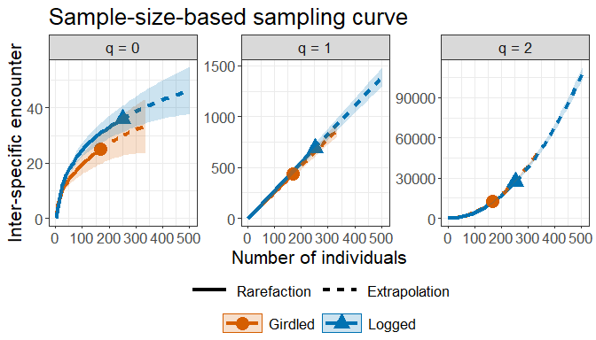
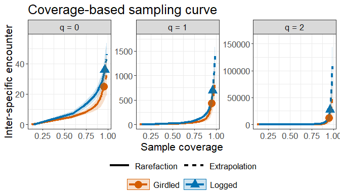

<!-- README.md is generated from README.Rmd. Please edit that file -->

# iNEXT.IE (R package)

<h5 align="right">
Latest version: 2025-12-08
</h5>
<font color="394CAE">
<h3 color="394CAE" style="font-weight: bold">
Introduction to iNEXT.IE (R package): Excerpt from iNEXT.IE User’s Guide
</h3>
</font> <br>
<h5>
<b>Kai-Hsiang Hu and Anne Chao</b> <br><br> <i>Institute of Statistics,
National Tsing Hua University, Hsin-Chu, Taiwan 30043</i>
</h5>

<br> `iNEXT.IE` (INterpolation and EXTrapolation for Inter-Specific
Encounter) is a framework for biodiversity methodology. ‘iNEXT.IE’
extends ‘iNEXT’ to incorporate inter-specific encounter (IE) of
biodiversity, which incorporates absolute species abundance. An online
version “iNEXT.IE Online”
(<https://kaihsiang-hu.shinyapps.io/iNEXT_IE/>) is also available for
users without prior experience in R.

`iNEXT.IE` features two statistical analyses (non-asymptotic and
asymptotic):

1.  A non-asymptotic approach based on interpolation and extrapolation
    for diversity

`iNEXT.IE` computes the estimated diversity for standardized samples
with a common sample size or sample completeness. This approach aims to
compare diversity estimates for equally-large (with a common sample
size) or equally-complete (with a common sample coverage) samples using
seamless rarefaction and extrapolation (R/E) sampling curves for q =
0.5, 1, and 2. `iNEXT.IE` offers three types of R/E sampling curves:

-   Sample-size-based (or size-based) R/E sampling curves: This type of
    sampling curve plots the diversity estimates with respect to sample
    size.

-   Coverage-based R/E sampling curves: This type of sampling curve
    plots the diversity estimates with respect to sample coverage.

-   Sample completeness curve: This curve depicts how sample coverage
    varies with sample size. The sample completeness curve provides a
    bridge between the size- and coverage-based R/E sampling curves.

1.  An asymptotic approach to infer asymptotic diversity

`iNEXT.IE` computes the estimated asymptotic diversity and also plots
diversity profiles (q-profiles) for q between 0.4 and 2, in comparison
with the maximum likelihood estimation. Typically, the asymptotic
estimates for q ≥ 1 are reliable, but for q \< 1 (especially when q is
near zero), they represent lower bounds only..

## How to cite

If you use results from the iNEXT.IE package in a publication, please
cite the following methodology paper and the package:

-   Hu, K.-H. and Chao, A. (2025). The iNEXT.IE package: INterpolation
    and EXTrapolation for Inter-Specific Encounter. R package available
    from CRAN.

## SOFTWARE NEEDED TO RUN iNEXT.IE IN R

-   Required: [R](https://cran.r-project.org/)
-   Suggested: [RStudio
    IDE](https://www.rstudio.com/products/RStudio/#Desktop)

## HOW TO RUN iNEXT.IE:

The `iNEXT.IE` package can be downloaded from CRAN or Kai-Hsiang Hu’s
[iNEXT.IE_github](https://github.com/KaiHsiangHu/iNEXT.IE) using the
commands below. For a first-time installation, some additional packages
must be installed and loaded; see the package manual for details.

``` r
## install iNEXT.IE package from CRAN
install.packages("iNEXT.IE")  

## or install the latest version from github
install.packages('devtools')
library(devtools)
install_github('KaiHsiangHu/iNEXT.IE')

## import packages
library(iNEXT.IE)
```

There are six main functions in this package:

Two functions for non-asymptotic analysis with graphical displays:

-   **iNEXTIE** computes standardized diversity estimates of order q =
    0.5, 1 and 2 for rarefied and extrapolated samples at specified
    sample coverage values and sample sizes.

-   **ggiNEXTIE** visualizes the output from the function `iNEXTIE`.

Two functions for point estimation and basic data information

-   **estimateIE** computes diversity of order q = 0.5, 1 and 2 with a
    particular set of user-specified level of sample sizes or sample
    coverage values.

-   **DataInfoIE** provides basic data information based on the observed
    data.

Two functions for asymptotic analysis with graphical displays:

-   **MLEAsyIE** computes maximum likelihood estimation and asymptotic
    diversity estimates of order q between 0.4 and 2 (in increments of
    0.2) for diversity.

-   **ggMLEAsyIE** visualizes the output from the function `MLEAsyIE`.

## <span style="color:red;">DATA INPUT FORMAT</span>

### Species abundance data format

For `iNEXT.IE` package, information on species identity (or any unique
identification code) and assemblage affiliation is not required.

Individual-based abundance data: Data can be input as a vector of
species abundances (for a single assemblage), a species (in rows) by
assemblage (in columns) matrix/data.frame, or a list of species
abundance vectors.

For example, we use “spider” data for illustration.

``` r
data("spider")
spider
$Girdled
 [1] 46 22 17 15 15  9  8  6  6  4  2  2  2  2  1  1  1  1  1  1  1  1  1  1  1  1

$Logged
 [1] 88 22 16 15 13 10  8  8  7  7  7  5  4  4  4  3  3  3  3  2  2  2  2  1  1  1  1  1  1  1  1  1  1  1  1  1  1
```

## <span style="color:red;">MAIN FUNCTION iNEXTIE(): RAREFACTION/EXTRAPOLATION</span>

We first describe the main function `iNEXTIE()` with default arguments:

``` r
iNEXTIE(data, rho = NULL, q = c(0.5, 1, 2), size = NULL, endpoint = NULL, knots = 40, nboot = 50, conf = 0.95)
```

The arguments of this function are briefly described below, and will be
explained in more details by illustrative examples in later text. This
main function computes standardized diversity estimates of order q =
0.5, 1 and 2, the sample coverage estimates, and related statistics for
K (if `knots = K` in the specified argument) evenly-spaced knots (sample
sizes) between size 1 and the `endpoint`, where the endpoint is
described below. Each knot represents a particular sample size for which
diversity estimates will be calculated. By default, `endpoint` = the
maximum sample sizes (see arguments). For example, if `endpoint = 10`,
`knot = 4` is specified, diversity estimates will be computed for a
sequence of samples with sizes (1, 4, 7, 10).

<table class="gmisc_table" style="border-collapse: collapse; margin-top: 1em; margin-bottom: 1em;">
<thead>
<tr>
<th style="font-weight: 900; border-bottom: 1px solid grey; border-top: 2px solid grey; text-align: center;">
Argument
</th>
<th style="font-weight: 900; border-bottom: 1px solid grey; border-top: 2px solid grey; text-align: center;">
Description
</th>
</tr>
</thead>
<tbody>
<tr>
<td style="text-align: left;">
data
</td>
<td style="text-align: left;">
data can be input as a vector of species abundances (for a single
assemblage), matrix/data.frame (species by assemblages), or a list of
species abundance vectors.
</td>
</tr>
<tr>
<td style="text-align: left;">
rho
</td>
<td style="text-align: left;">
the sampling fraction can be input as a vector for each assemblage, or
enter a single numeric value to apply to all assemblages.
</td>
</tr>
<tr>
<td style="text-align: left;">
q
</td>
<td style="text-align: left;">
a numerical vector specifying the diversity orders. Default is
<code>c(0.5, 1, 2)</code>.
</td>
</tr>
<tr>
<td style="text-align: left;">
size
</td>
<td style="text-align: left;">
an integer vector of sample sizes (number of individuals) for which
diversity estimates will be computed. If <code>NULL</code>, then
diversity estimates will be computed for those sample sizes determined
by the specified/default <code>endpoint</code> and <code>knots</code>.
</td>
</tr>
<tr>
<td style="text-align: left;">
endpoint
</td>
<td style="text-align: left;">
an integer specifying the sample size that is the <code>endpoint</code>
for rarefaction/extrapolation. If <code>NULL</code>, then
<code>endpoint</code> <code>=</code> the maximum sample sizes, which is
set to double the reference sample size when rho is less than 0.2;
triple the reference sample size when rho is between 0.2 and 0.4; and
the total number of individuals when rho exceeds 0.4.
</td>
</tr>
<tr>
<td style="text-align: left;">
knots
</td>
<td style="text-align: left;">
an integer specifying the number of equally-spaced <code>knots</code>
(say K, default is 40) between size 1 and the <code>endpoint</code>;
each knot represents a particular sample size for which diversity
estimate will be calculated. If the <code>endpoint</code> is smaller
than the reference sample size, then <code>iNEXTIE()</code> computes
only the rarefaction estimates for approximately K evenly spaced
<code>knots</code>. If the <code>endpoint</code> is larger than the
reference sample size, then <code>iNEXTIE()</code> computes rarefaction
estimates for approximately K/2 evenly spaced <code>knots</code> between
sample size 1 and the reference sample size, and computes extrapolation
estimates for approximately K/2 evenly spaced <code>knots</code> between
the reference sample size and the <code>endpoint</code>.
</td>
</tr>
<tr>
<td style="text-align: left;">
nboot
</td>
<td style="text-align: left;">
a positive integer specifying the number of bootstrap replications when
assessing sampling uncertainty and constructing confidence intervals.
Enter 0 to skip the bootstrap procedures. Default is 50.
</td>
</tr>
<tr>
<td style="border-bottom: 2px solid grey; text-align: left;">
conf
</td>
<td style="border-bottom: 2px solid grey; text-align: left;">
a positive number \< 1 specifying the level of confidence interval.
Default is 0.95.
</td>
</tr>
</tbody>
</table>

The main function `iNEXTIE()` returns the `iNEXTIE` object, which can be
further used to make plots using the function `ggiNEXTIE()` to be
described below. The `"iNEXTIE"` object includes three lists:

1.  `$DataInfo` for summarizing data information.

2.  `$iNextEst` for showing diversity estimates along with related
    statistics for a series of rarefied and extrapolated samples; there
    are two data frames (`$size_based` and `$coverage_based`)
    conditioning on standardized sample size or sample coverage,
    respectively.

3.  `$AsyEst` for showing maximum likelihood estimation and asymptotic
    diversity estimates along with related statistics.

## <span style="color:red;">FUNCTION ggiNEXTIE(): GRAPHIC DISPLAYS</span>

The function `ggiNEXTIE()`, which extends `ggplot2` with default
arguments, is described as follows:

``` r
ggiNEXTIE(output, type = 1:3, log2 = FALSE)  
```

Here `output` is the `iNEXTIE()` object. Three types of curves are
allowed for diversity:

1.  Sample-size-based R/E curve (`type = 1`): This curve plots diversity
    estimates with confidence intervals as a function of sample size.

2.  Sample completeness curve (`type = 2`): This curve plots the sample
    coverage with respect to sample size.

3.  Coverage-based R/E curve (`type = 3`): This curve plots the
    diversity estimates with confidence intervals as a function of
    sample coverage.

The setting `log2` represents whether to apply a log2 transformation to
diversity or not. (only for `type = 1` or `3`) The `ggiNEXTIE()`
function is a wrapper with the package `ggplot2` to create a
rarefaction/extrapolation sampling curve in a single line of code. The
figure object is of class `"ggplot"`, so it can be manipulated by using
the `ggplot2` tools.

## <span style="color:blue;">RAREFACTION/EXTRAPOLATION VIA EXAMPLES</span>

### EXAMPLE: rarefaction/extrapolation for abundance data

Based on the dataset, the following commands return all numerical
results. The first list of the output (`$DataInfo`) returns basic data
information including the name of the Assemblage, sample size (`n`),
total abundance (`N`), sampling fraction (`rho`), observed species
richness (`S.obs`), sample coverage estimate of the reference sample
with size n (`SC(n)`), sample coverage estimate of the extrapolated
sample with size 2n (`SC(2n)`) as well as the first five species
abundance frequency counts in the reference sample (`f1-f5`). If only
data information is required, the simpler function `DataInfoIE()` (see
later text) can be used to obtain the same output.

``` r
data("spider")
output_iNEXT <- iNEXTIE(spider, rho = 0.3, q = c(0.5, 1, 2))
output_iNEXT$DataInfo
```

    $DataInfo
      Assemblage   n   N rho S.obs SC(n) SC(2n) f1 f2 f3 f4 f5
    1    Girdled 168 560 0.3    26 0.950  0.977 12  4  0  1  0
    2     Logged 252 840 0.3    37 0.961  0.981 14  4  4  3  1

The second list of the output (`$iNextEst`) includes size- and
coverage-based standardized diversity estimates and related statistics
computed for 40 knots by default. There are two data frames
(`$size_based` and `$coverage_based`).

The first data frame (`$size_based`) includes the name of the assemblage
(`Assemblage`), diversity order (`Order.q`), the target sample size
(`m`), the `Method` (`Rarefaction`, `Observed`, or `Extrapolation`,
depending on whether the size `m` is less than, equal to, or greater
than the reference sample size), the diversity estimate of order q
(`qIE`), the lower and upper confidence limits of diversity (`qIE.LCL`
and `qIE.UCL`) conditioning on the sample size, and the corresponding
sample coverage estimate (`SC`) along with the lower and upper
confidence limits of sample coverage (`SC.LCL` and `SC.UCL`). These
sample coverage estimates and their confidence intervals are used to
construct the sample completeness curve. If the argument `nboot` is
greater than zero, then a bootstrap method is applied to obtain the
confidence intervals for the diversity and sample coverage estimates.
Otherwise, all confidence intervals will not be computed. Only the first
six rows of the `$size_based` output are displayed below.

``` r
output_iNEXT$iNextEst$size_based
```

      Assemblage Order.q  m      Method      qIE  qIE.LCL  qIE.UCL    SC SC.LCL SC.UCL
    1    Girdled     0.5  1 Rarefaction    0.000    0.000    0.000 0.124  0.100  0.148
    2    Girdled     0.5  9 Rarefaction  117.346  104.407  130.285 0.578  0.535  0.621
    3    Girdled     0.5 18 Rarefaction  400.897  348.152  453.641 0.736  0.695  0.778
    4    Girdled     0.5 27 Rarefaction  756.481  645.530  867.432 0.808  0.771  0.845
    5    Girdled     0.5 36 Rarefaction 1155.808  972.798 1338.818 0.846  0.812  0.881
    6    Girdled     0.5 44 Rarefaction 1538.593 1281.986 1795.199 0.868  0.836  0.900

The second data frame (`$coverage_based`) includes the name of
assemblage (`Assemblage`), the diversity order (`Order.q`), the target
sample coverage value (`SC`), the corresponding sample size (`m`), the
`Method` (`Rarefaction`, `Observed`, or `Extrapolation`, depending on
whether the coverage `SC` is less than, equal to, or greater than the
reference sample coverage), the diversity estimate of order q (`qIE`),
the lower and upper confidence limits of diversity (`qIE.LCL` and
`qIE.UCL`) conditioning on the target sample coverage value. Only the
first six rows of the `$coverage_based output` are displayed below.
(Note for a fixed coverage value, the confidence interval in the
`$coverage_based` table is wider than the corresponding interval in the
`$size_based` table. This is because, for a given coverage value, the
sample size needed to attain a fixed coverage value varies with
bootstrap replication, leading to higher uncertainty on the resulting
diversity estimate.)

``` r
output_iNEXT$iNextEst$coverage_based
```

      Assemblage Order.q    SC  m      Method      qIE qIE.LCL  qIE.UCL
    1    Girdled     0.5 0.124  1 Rarefaction    0.000   0.000    0.034
    2    Girdled     0.5 0.578  9 Rarefaction  117.346  69.718  164.974
    3    Girdled     0.5 0.736 18 Rarefaction  400.897 223.681  578.113
    4    Girdled     0.5 0.808 27 Rarefaction  756.481 387.101 1125.861
    5    Girdled     0.5 0.846 36 Rarefaction 1155.808 525.622 1785.994
    6    Girdled     0.5 0.868 44 Rarefaction 1538.593 618.810 2458.375

The third list of the output (`$AsyEst`) includes the name of the
Assemblage, diversity order (q = 0.5, 1, 2), the maximum likelihood
estimation estimate (`IE_MLE`), asymptotic diversity estimate (`IE_asy`)
and its estimated bootstrap standard error (`s.e.`) as well as the
confidence intervals for asymptotic diversity (`qIE.LCL` and `qIE.UCL`).
These statistics are computed only for q = 0.5, 1 and 2. More detailed
information about maximum likelihood estimation and asymptotic diversity
estimates for any order q between 0.4 and 2 can be obtained from
function `MLEAsyIE()`. The output for `$AsyEst` is shown below:

``` r
output_iNEXT$AsyEst
```

      Assemblage Order.q    IE_MLE    IE_asy     s.e.   qIE.LCL    qIE.UCL
    1    Girdled     0.5 29157.412 38234.978 5379.820 27690.724  48779.232
    2    Girdled     1.0  1407.199  1459.750   49.738  1362.265   1557.236
    3    Girdled     2.0   369.865   370.407    2.409   365.685    375.128
    4     Logged     0.5 65623.287 82938.079 9065.532 65169.962 100706.195
    5     Logged     1.0  2260.176  2331.295   81.155  2172.235   2490.355
    6     Logged     2.0   548.290   548.825    5.409   538.224    559.426

The `ggiNEXTIE` function can be used to make graphical displays for
rarefaction and extrapolation sampling curves. An example for showing
sample-size-based rarefaction/extrapolation curves (`type = 1`) is given
below:

``` r
# Sample-size-based R/E curves
ggiNEXTIE(output_iNEXT, type = 1)
```



The following commands return the sample completeness (sample coverage)
curve (`type = 2`) in which different colors represent different
assemblages.

``` r
# Sample completeness curves 
ggiNEXTIE(output_iNEXT, type = 2)
```


The following commands return the coverage-based
rarefaction/extrapolation sampling curves in which different color
curves represent two assemblages within each diversity order.

``` r
# Coverage-based R/E curves
ggiNEXTIE(output_iNEXT, type = 3)
```



## <span style="color:red;">FUNCTION DataInfoIE(): DATA INFORMATION</span>

The function `DataInfoIE()` provides basic data information for the
reference sample in each assemblage. The function `DataInfoIE()` with
default arguments is shown below:

``` r
DataInfoIE(data, rho = NULL) 
```

All arguments in the above function are the same as those for the main
function `iNEXTIE`. Running the `DataInfoIE()` function returns basic
data information including the following:

-   `Assemblage` = assemblage name.

-   `n` = number of observed individuals in the reference sample (sample
    size).

-   `N` = total abundance in the overall assemblage.

-   `rho` = sampling fraction of the reference sample.

-   `S.obs` = number of observed species in the reference sample.

-   `SC(n)` = sample coverage estimate of the reference sample with size
    n.

-   `SC(2n)` = sample coverage estimate of the reference sample with
    size 2n.

-   `f1`-`f5` = the first five species abundance frequency counts in the
    reference sample.

We use data to demo the function.

### Basic data information for abundance data

``` r
data("spider")
DataInfoIE(spider, rho = 0.3)
```

      Assemblage   n   N rho S.obs SC(n) SC(2n) f1 f2 f3 f4 f5
    1    Girdled 168 560 0.3    26 0.950  0.977 12  4  0  1  0
    2     Logged 252 840 0.3    37 0.961  0.981 14  4  4  3  1

## <span style="color:red;">FUNCTION estimateIE(): POINT ESTIMATION</span>

`estimateIE` is used to compute diversity estimates with q = 0.5, 1, 2
under any specified levels of sample size (when `base = "size"`) and
sample coverage values (when `base = "coverage"`) for abundance data.
When `base = "size"`, `level` can be specified with a particular vector
of sample sizes (greater than 0); if `level = NULL`, this function
computes the diversity estimates for the minimum sample size among all
samples extrapolated to the maximum sample sizes. When
`base = "coverage"`, `level` can be specified with a particular vector
of sample coverage values (between 0 and 1); if `level = NULL`, this
function computes the diversity estimates for the minimum sample
coverage among all samples extrapolated to the maximum sample sizes.
Specifically, the maximum extrapolation limit is set to double the
reference sample size when rho is less than 0.2; triple the reference
sample size when rho is between 0.2 and 0.4; and the total number of
individuals when rho exceeds 0.4. All arguments in the function are the
same as those for the main function `iNEXTIE`.

``` r
estimateIE(data, rho = NULL, q = c(0.5, 1, 2), base = "coverage", level = NULL, nboot = 50, conf = 0.95) 
```

### Example: abundance data with two target coverage values (97% and 99%)

The following commands return the estimates with two specified levels of
sample coverage (94% and 96%).

``` r
data("spider")
output_est_cov <- estimateIE(spider, rho = 0.3, q = c(0.5, 1, 2), base = "coverage", level = c(0.94, 0.96))
output_est_cov
```

       Assemblage Order.q   SC       m        Method       qIE     s.e.  qIE.LCL   qIE.UCL
    1     Girdled     0.5 0.94 138.409   Rarefaction  7307.102 2078.097 3234.107 11380.097
    2     Girdled     0.5 0.96 215.651 Extrapolation 13041.560 3943.163 5313.102 20770.017
    3     Girdled     1.0 0.94 138.409   Rarefaction   353.853   71.510  213.696   494.011
    4     Girdled     1.0 0.96 215.651 Extrapolation   557.961  123.074  316.740   799.182
    5     Girdled     2.0 0.94 138.409   Rarefaction    91.358   16.849   58.334   124.381
    6     Girdled     2.0 0.96 215.651 Extrapolation   142.233   29.579   84.260   200.206
    7      Logged     0.5 0.94 164.121   Rarefaction 12286.794 3755.476 4926.197 19647.392
    8      Logged     0.5 0.96 244.422   Rarefaction 20305.097 7836.336 4946.161 35664.033
    9      Logged     1.0 0.94 164.121   Rarefaction   446.173   85.988  277.639   614.706
    10     Logged     1.0 0.96 244.422   Rarefaction   670.800  167.078  343.333   998.267
    11     Logged     2.0 0.94 164.121   Rarefaction   107.012   18.714   70.333   143.691
    12     Logged     2.0 0.96 244.422   Rarefaction   159.531   36.874   87.260   231.803

### Example: abundance data with two target sample sizes (150 and 250)

The following commands return the estimates with two specified levels of
sample sizes (150 and 250).

``` r
data("spider")
output_est_size <- estimateIE(spider, rho = 0.3, q = c(0.5, 1, 2), base = "size", level = c(150, 250))
output_est_size
```

       Assemblage Order.q   m        Method    SC       qIE     s.e.   qIE.LCL   qIE.UCL
    1     Girdled     0.5 150   Rarefaction 0.944  8129.064 1079.497  6013.288 10244.840
    2     Girdled     0.5 250 Extrapolation 0.966 15704.204 2306.331 11183.878 20224.529
    3     Girdled     1.0 150   Rarefaction 0.944   384.433   15.635   353.788   415.077
    4     Girdled     1.0 250 Extrapolation 0.966   648.699   27.017   595.747   701.651
    5     Girdled     2.0 150   Rarefaction 0.944    99.035    0.799    97.470   100.601
    6     Girdled     2.0 250 Extrapolation 0.966   164.994    1.330   162.386   167.601
    7      Logged     0.5 150   Rarefaction 0.934 10944.269 1030.468  8924.589 12963.948
    8      Logged     0.5 250   Rarefaction 0.961 20883.770 2185.764 16599.752 25167.788
    9      Logged     1.0 150   Rarefaction 0.934   406.734   12.952   381.349   432.120
    10     Logged     1.0 250   Rarefaction 0.961   686.424   22.235   642.844   730.005
    11     Logged     2.0 150   Rarefaction 0.934    97.776    0.848    96.114    99.438
    12     Logged     2.0 250   Rarefaction 0.961   163.179    1.415   160.406   165.952

## <span style="color:red;">FUNCTION MLEAsyIE: MAXIMUM LIKELIHOOD ESTIMATION AND ASYMPTOTIC DIVERSITY PROFILES</span>

``` r
MLEAsyIE(data, rho = NULL, q = seq(0.4, 2, 0.2), nboot = 50, conf = 0.95, method = c('Asymptotic', 'MLE'))
```

All arguments in the above function are the same as those for the main
function `iNEXTIE` (except that the default of `q` here is
`seq(0.4, 2, 0.2)`). The function `MLEAsyIE()` computes maximum
likelihood estimation and asymptotic diversity of order q between 0.4
and 2 (in increments of 0.2) for diversity; these values with different
order q can be used to depict a q-profile in the `ggMLEAsyIE` function.
By default, both the maximum likelihood estimation and asymptotic
diversity estimates will be computed.

## <span style="color:red;">FUNCTION ggMLEAsyIE(): GRAPHIC DISPLAYS OF DIVERSITY PROFILES</span>

``` r
ggMLEAsyIE(output, log2 = FALSE)
```

`ggMLEAsyIE` is a ggplot2 extension for an `MLEAsyIE` object to plot
q-profile (which depicts the maximum likelihood estimation and
asymptotic diversity estimate with respect to order q) for q between 0.4
and 2 (in increments of 0.2) in default. The setting `log2` represents
whether to apply a log2 transformation to diversity or not.

In the plot of profiles, only confidence intervals of the asymptotic
diversity will be shown when both the maximum likelihood estimation and
asymptotic diversity estimates are computed.

### Example: q-profiles for abundance data

The following commands returns the maximum likelihood estimation and
asymptotic taxonomic diversity, along with its confidence interval for
diversity order q between 0 to 2. Here only the first ten rows of the
output are shown.

``` r
data("spider")
output_MLEAsy <- MLEAsyIE(spider, rho = 0.3)
output_MLEAsy
```

       Assemblage Order.q        qIE       s.e.    qIE.LCL    qIE.UCL     Method
    1     Girdled     0.4 216158.530  44577.692 128787.859 303529.200 Asymptotic
    2     Girdled     0.6  12333.930   1181.261  10018.701  14649.159 Asymptotic
    3     Girdled     0.8   3155.430    157.828   2846.093   3464.767 Asymptotic
    4     Girdled     1.0   1459.750     42.632   1376.193   1543.308 Asymptotic
    5     Girdled     1.2    899.267     17.278    865.403    933.131 Asymptotic
    6     Girdled     1.4    647.285      8.902    629.838    664.733 Asymptotic
    7     Girdled     1.6    510.684      5.286    500.323    521.045 Asymptotic
    8     Girdled     1.8    426.829      3.404    420.156    433.502 Asymptotic
    9     Girdled     2.0    370.407      2.296    365.906    374.907 Asymptotic
    10     Logged     0.4 551765.980 113709.472 328899.510 774632.450 Asymptotic

The following commands plot the corresponding q-profiles, along with its
confidence interval for q between 0 to 2 with log2 transformation to
diversity.

``` r
ggMLEAsyIE(output_MLEAsy, log2 = TRUE)
```


## License

The iNEXT.IE package is licensed under the GPLv3. To help refine
`iNEXT.IE`, your comments or feedback would be welcome (please send them
to Kai-Hsiang Hu or report an issue on the iNEXT.IE github
[iNEXT.IE_github](https://github.com/KaiHsiangHu/iNEXT.IE)).

## References
